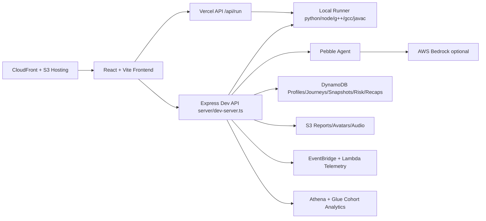

# PebbleCode

> Elite coding practice with real runtime feedback, mentor-level guidance, and measurable recovery analytics.

PebbleCode helps learners recover quickly from mistakes and build reliable problem-solving habits. It combines a premium in-browser IDE, structured AI coaching, run/submit telemetry, and insight dashboards in one workflow.

## Why PebbleCode
- **Recovery-first practice loop**: run, diagnose, recover, and retry with clear feedback.
- **Tiered mentor guidance**: Hint → Explain → Next step (with policy and safety constraints).
- **LeetCode-style flow with coaching context**: problems browser + session IDE + coach panel.
- **Measurable progress**: autonomy rate, recovery timing, streak signals, and cohort analytics.
- **Hackathon-safe demo mode**: works locally without AWS, then scales to AWS services when configured.

---

## Judges Quickstart (2 minutes)

### Prerequisites
- Node.js 18+
- npm 9+
- Python 3 (`python3`)
- Node runtime (`node`)
- g++ (`g++`)
- gcc (`gcc`)
- Java 17+ (`javac`, `java`)

### Run locally (frontend + API + local runner)
```bash
npm install
npm run dev:full
```
Open [http://localhost:5173](http://localhost:5173).

### Fast click path
1. **Home** → click `Try Pebble`
2. **Session IDE** → choose language (Python/JS/C++/Java/C)
3. Click **Run tests**, then **Submit**
4. Open **Pebble Coach** and try Hint/Explain/Next-step
5. Visit **Insights / Dashboard**
6. Click **Export report** in session to generate/download the recovery PDF

---

## Demo Script (2–4 minutes)

1. **Set context (20s)**
   - “PebbleCode is a recovery-focused coding coach, not just an editor.”
2. **Problem attempt (60–90s)**
   - Open Session, run starter code, trigger a failing case, then fix and rerun.
3. **Mentor interaction (45–60s)**
   - Use Pebble Coach tiers (Hint → Explain). Show guided, non-spoiler help.
4. **Proof of measurement (30–45s)**
   - Show run/submit outcomes and insight cards (autonomy/recovery signals).
5. **Report export (20–30s)**
   - Export single-page premium PDF recovery report.

---

## Feature Tour

### 1) Session IDE + Runtime Feedback
- Monaco-based IDE with language switching.
- Local/remote runner integration via `POST /api/run`.
- Structured run/submit test feedback with pass/fail diagnostics.
- Supports Python 3, JavaScript, Java 17, C++17, C (GNU) in the current runner pipeline.

### 2) Pebble Coach (Mentor)
- Guided coaching panel with quick actions and tiered response modes.
- Server-side agent flow with safety/policy enforcement.
- Bedrock-backed path when configured; robust local fallback when not.

### 3) Problems Browser
- Filter/search by difficulty/topics/languages.
- Session launch flow integrated with current problem context.

### 4) Insights + Live Metrics
- Recovery KPIs and progress indicators.
- Cohort analytics endpoint with AWS Athena path + local fallback.
- Admin Ops page (`/ops`) for runtime observability metrics.

### 5) Export Recovery Report
- Premium single-page PDF report generation.
- Includes attempts/runs/submits/autonomy/hints/errors + summary.
- Uses signed-in user identity for report metadata and filename.
- S3-backed storage when configured, local download fallback otherwise.

### 6) Auth + Profile System
- Cognito-based auth flows (login/signup/forgot-password).
- Username availability + cooldown-enforced username changes.
- Avatar upload with key-based persistence and signed URL retrieval.

---

## Architecture Overview



### Runtime modes
- **Local-first dev**: `npm run dev:full` runs frontend + Express API + local toolchains.
- **AWS-enhanced**: optional services (Bedrock, Athena, S3, DynamoDB, Step Functions, Polly, SageMaker) activate via env vars.
- **Vercel-compatible API**: `/api/run` supports local/remote modes with explicit diagnostics.

---

## Tech Stack

| Layer | Stack |
|---|---|
| Frontend | React 19, TypeScript, Vite, Tailwind, Framer Motion, Monaco |
| App State / Routing | React Router, custom providers/hooks |
| Backend (local) | Express 5 + TypeScript (`server/dev-server.ts`) |
| API (Vercel) | Serverless handlers in `/api` |
| Code Execution | python3, node, g++, gcc, javac/java toolchains |
| AI | AWS Bedrock Runtime (with local fallback path) |
| Data & Analytics | DynamoDB, EventBridge, Lambda, Athena, Glue |
| Files | S3 (reports, avatars, recap audio), signed URLs |
| Infra as Code | AWS CDK v2 (`infra/`) |

---

## Setup

## Local Setup (recommended for judges)

1. Install dependencies:
```bash
npm install
```

2. Create local env file:
```bash
cp .env.example .env.local
```

3. Start full local stack:
```bash
npm run dev:full
```

4. Open:
- Frontend: [http://localhost:5173](http://localhost:5173)
- Dev API health: [http://localhost:3001/api/health](http://localhost:3001/api/health)

### Local quality checks
```bash
npm run lint
npm run typecheck
npm run build
npm run smoke
npm run smoke:runner-modes
npm run self-check:language-pipeline
npm run test:function-mode
```

## Environment Variables

Use `.env.local` for local development.

### Core / Required for basic local
| Variable | Required | Purpose |
|---|---|---|
| `AWS_REGION` | No (recommended) | Region for optional AWS clients |
| `FRONTEND_ORIGIN` | No | Used for share/report links (default localhost) |
| `PROFILES_TABLE_NAME` | No | Profiles table name (defaults in local flow) |
| `VITE_COGNITO_USER_POOL_ID` | For Cognito auth | Frontend Cognito config |
| `VITE_COGNITO_CLIENT_ID` | For Cognito auth | Frontend Cognito config |

### Runner / Execution
| Variable | Required | Purpose |
|---|---|---|
| `PEBBLE_RUNNER_MODE` | No | `local` or `remote` runner behavior |
| `RUNNER_URL` | Remote mode | External runner URL |
| `RUNNER_LAMBDA_NAME` | Remote mode | Lambda name for runner invoke path |

### AI / Safety
| Variable | Required | Purpose |
|---|---|---|
| `BEDROCK_MODEL_ID` | Bedrock mode | Model ID for coach/agent path |
| `BEDROCK_GUARDRAIL_ID` | Optional | Bedrock guardrail integration |
| `BEDROCK_GUARDRAIL_VERSION` | Optional | Guardrail version (default `DRAFT`) |
| `SAFETY_MODE` | No | `auto` / `strict` / `off` |

### Files / Reports / Avatars
| Variable | Required | Purpose |
|---|---|---|
| `AVATARS_BUCKET_NAME` | For S3 avatar mode | Avatar upload target bucket |
| `REPORTS_BUCKET_NAME` | For S3 report mode | Recovery report PDF bucket |
| `SNAPSHOTS_TABLE_NAME` | Snapshot feature | Session snapshot storage |

### Analytics / Journeys / Premium demo services
| Variable | Purpose |
|---|---|
| `INGEST_EVENTS_LAMBDA_NAME` | Event ingestion |
| `EVENT_LAKE_BUCKET` | Athena event-lake source |
| `JOURNEYS_TABLE_NAME` | Learning journey state |
| `JOURNEY_STATE_MACHINE_ARN` | Step Functions orchestration |
| `RISK_PREDICTIONS_TABLE_NAME` | Risk predictor persistence |
| `SAGEMAKER_ENDPOINT_NAME` / `SAGEMAKER_REGION` / `RISK_MODE` | Risk inference mode |
| `WEEKLY_RECAPS_TABLE_NAME` / `RECAP_AUDIO_BUCKET_NAME` / `POLLY_VOICE_ID` / `RECAP_MODE` | Weekly recap + TTS |
| `ADMIN_OPS_TOKEN` / `VITE_ADMIN_TOKEN` | Ops page metrics access |
| `ADMIN_EMAILS` | Admin allowlist |

---

## AWS Setup (CDK)

Infrastructure lives in `/infra` and includes backend, hosting, analytics, journeys, files, observability, and premium demo stacks.

### 1) Install infra deps
```bash
cd infra
npm ci
```

### 2) Bootstrap (once per account/region)
```bash
npx cdk bootstrap aws://<ACCOUNT_ID>/<REGION>
```

### 3) Deploy stacks
```bash
# deploy core + phase stacks defined in infra/bin/infra.ts
npx cdk deploy --all
```

### 4) Deploy frontend to S3 + CloudFront
From repo root:
```bash
bash infra/scripts/deploy-frontend.sh
```
Optional overrides:
```bash
AWS_REGION=ap-south-1 AWS_PROFILE=my-profile STACK_NAME=PebbleHostingStack bash infra/scripts/deploy-frontend.sh
```

### 5) Verify CloudFront
Use stack outputs from CDK (`CloudFrontDistributionDomainName`, `CloudFrontDistributionId`, `S3BucketName`).

> If your AWS credentials/account outputs are not configured locally, runbook commands above are still the correct deployment flow; do not hardcode bucket/distribution IDs.

---

## Project Structure

```text
.
├── src/
│   ├── pages/                 # Landing, Problems, Session, Dashboard, Profile, Auth, Legal
│   ├── components/            # layout, home, session, ui, auth components
│   ├── providers/             # auth/i18n/theme-style providers
│   ├── data/                  # problems + content banks
│   └── lib/                   # run API, auth, storage, mode/language helpers
├── server/
│   ├── dev-server.ts          # Local API hub (run, coach, profile, reports, analytics...)
│   ├── runnerLocal.ts         # Local multi-language execution engine
│   ├── reports/               # PDF generation and report assembly
│   ├── safety/                # redaction, policy, guardrails
│   └── pebbleAgent/           # mentor orchestration
├── api/                       # Vercel serverless handlers
├── infra/                     # AWS CDK stacks + deploy scripts
├── shared/                    # shared registries/types (language registry, etc.)
├── scripts/                   # smoke checks and self-check utilities
└── docs/                      # operational docs (e.g. vercel runner debug)
```

---

## Safety, Privacy, and Guardrails

- Sensitive patterns are redacted in safety middleware before responses are surfaced.
- Tiered mentor response policy limits solution leakage in lower guidance tiers.
- Unsafe-content checks and optional Bedrock guardrails are integrated server-side.
- Auth-protected flows gate user-specific profile/report behaviors.
- Exported session snapshots are metadata-first (no raw secret dumping by design).

---

## Troubleshooting

### “Cognito not configured” in frontend
- Set `VITE_COGNITO_USER_POOL_ID` and `VITE_COGNITO_CLIENT_ID`.
- Vite is configured with `envPrefix: ['VITE_', 'COGNITO_']`, but VITE-prefixed vars are recommended.
- Rebuild/redeploy after env changes.

### `/api/run` returns runner config error
- Local dev: run `npm run dev:full` so backend is available.
- Vercel/remote mode: set either `RUNNER_URL` or both `AWS_REGION` + `RUNNER_LAMBDA_NAME`.
- See `/docs/vercel-run-debug.md`.

### Language toolchain unavailable
Install missing local tools and ensure PATH:
- `python3`, `node`, `g++`, `gcc`, `javac`, `java`.

### Bedrock mentor falls back locally
- Verify `AWS_REGION` and `BEDROCK_MODEL_ID`.
- Ensure AWS credentials have Bedrock runtime access.
- Without these, local fallback responses are expected.

### Avatar/report storage not persistent
- Set `AVATARS_BUCKET_NAME` / `REPORTS_BUCKET_NAME` for S3-backed mode.
- Without bucket vars, dev server uses local/offline fallback behavior.

### CloudFront deploy script fails
- Confirm `infra` stack is deployed and outputs exist.
- Confirm AWS credentials/profile/region are active.
- Run from repository root: `bash infra/scripts/deploy-frontend.sh`.

---

## Screenshots / GIFs

If you are preparing a submission deck, add captures under `docs/screenshots/` and reference them here.

Recommended captures:
1. `home-hero-dark.png`
2. `session-ide-run-fail-pass.png`
3. `coach-tiered-guidance.png`
4. `problems-browser-filters.png`
5. `insights-dashboard.png`
6. `export-report-pdf.png`

---

## Roadmap / What’s Next

Near-term priorities based on current codebase trajectory:
- Harden multi-language parity tests across all problem types and harnesses.
- Expand problem pack depth (more hidden tests + richer editorials).
- Strengthen deployment ergonomics (single-command environment bootstrap + outputs sync).
- Broaden analytics narratives and cohort comparison tooling.

Long-term items remain in `ROADMAP.md`; treat that file as historical direction, while this README reflects currently implemented capabilities.

---

## Credits

Built by the PebbleCode team for recovery-first coding practice.

## License

No explicit OSS license file is currently defined in this repository.
