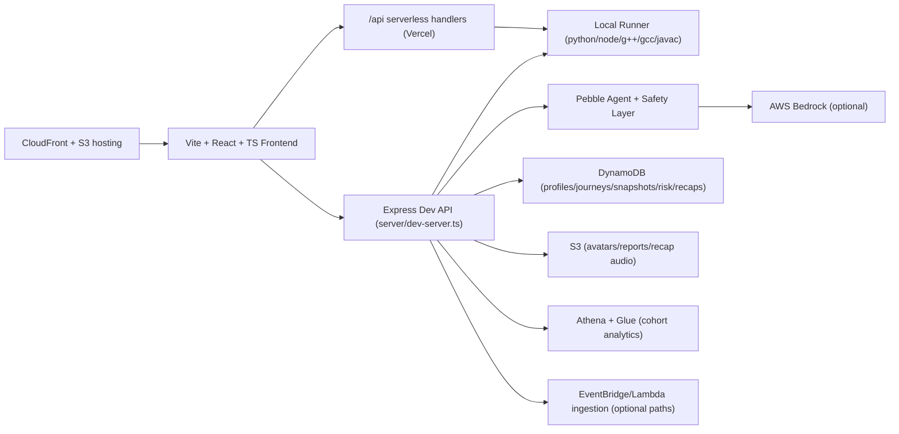

# PebbleCode

**Recovery-first coding practice** with a premium IDE, mentor guidance, and measurable progress signals.

PebbleCode helps learners recover from mistakes faster, not just solve once. It combines:
- a LeetCode-style coding loop,
- tiered mentor guidance (Hint → Explain → Next step),
- telemetry-backed progress insights,
- and exportable recovery reports.

## Why PebbleCode
- **Recovery loop, not just correctness**: run, diagnose, adjust, rerun.
- **Mentor with guardrails**: context-aware guidance with controlled hint depth.
- **Real execution support**: Python, JavaScript, Java 17, C++17, and C (GNU) in local runner pipelines.
- **Measurable momentum**: attempts, recovery time, autonomy rate, hint usage, streak/risk views.
- **Demo-ready local mode + AWS path**: works fully in local mode, scales with optional AWS services.

---

## Judges Quickstart

### Requirements
- Node.js 18+
- npm 9+
- Local toolchains for runner checks:
  - `python3`
  - `node`
  - `g++`
  - `gcc`
  - `javac` + `java` (JDK 17+)

### One-command run
```bash
npm install
npm run dev:full
```

Open [http://localhost:5173](http://localhost:5173).

### Fast click path (demo flow)
1. Home → **Try Pebble**
2. Session IDE → pick a language → **Run tests**
3. Trigger a fail → use **Pebble Coach**
4. Fix and **Submit**
5. Open **Dashboard / Insights**
6. Click **Export Report**

---

## Demo Script (2–4 min)

1. **Setup context (20s)**  
   “PebbleCode measures how quickly you recover from coding mistakes, not only final AC.”
2. **Run-fail-fix loop (60–90s)**  
   In Session IDE, run starter code, show failing test, apply fix, rerun.
3. **Mentor assist (45–60s)**  
   Open Pebble Coach and use Hint/Explain/Next-step guidance.
4. **Progress proof (30–45s)**  
   Show insights cards (autonomy, recovery trends, weekly recap/risk widgets if configured).
5. **Export evidence (20–30s)**  
   Export the one-page Recovery Report PDF.

---

## Feature Tour

### IDE + Runtime Feedback
- Monaco editor in a session shell with run/submit actions.
- Structured test feedback and diagnostics.
- Language switching with registry-backed metadata and runtime probing.
- Local runner in `server/runnerLocal.ts` supports:
  - Python 3
  - JavaScript
  - C++17
  - Java 17
  - C (GNU)

### Pebble Coach
- Mentor panel with tiered guidance flows.
- Safety/policy layer (`server/safety/*`, `server/pebbleAgent/policy.ts`).
- Bedrock-backed generation path when configured, local fallback behavior when not.

### Problems + Session Modes
- Problems browser with filtering and previews.
- **Stdio mode** for problem-bank style tasks.
- **Function mode** wrappers for curriculum units where configured (`src/lib/functionMode.ts`).
- SQL problem support in stdio-style flow.

### Insights + Ops
- Dashboard widgets for trend/risk/weekly recap surfaces.
- Cohort analytics endpoint with AWS Athena path and local fallback behavior.
- Admin ops metrics page (`/ops`) gated by token/email checks.

### Auth + Profiles
- Cognito-backed auth flows in frontend + dev API:
  - login
  - signup
  - verify email code (dev API route)
  - resend verification code (dev API route)
- Profile editing with username rules, cooldown checks, and avatar flow.

### Export Recovery Report
- Server-generated, premium dark one-page PDF (`server/reports/pdfGenerator.ts`).
- Includes user/problem/session metadata, KPI cards, error breakdown, and summary bullets.
- Filename includes sanitized user + problem + date.

### Notification Center
- Header bell opens filtered notifications (All / Coach / Progress / System).
- Local persisted notification state by user scope.
- Hooked into key flows (run/submit/export/profile/sign-in where wired).

---

## Architecture Overview



### Runtime model
- **Local-first**: `npm run dev:full` runs frontend + dev API + local runner.
- **AWS-enhanced**: additional services activate via env vars and IAM permissions.
- **Hybrid serverless**: `/api/run` supports local mode, remote URL mode, or Lambda invocation.

---

## Tech Stack

| Layer | Technologies |
|---|---|
| Frontend | React 19, TypeScript, Vite, Tailwind, Framer Motion, Monaco |
| Local API | Express 5 + TypeScript |
| Serverless API | Vercel handlers in `api/` |
| Runner | Python, Node, g++, gcc, javac/java |
| AI | AWS Bedrock Runtime (optional) |
| Data | DynamoDB, EventBridge, Athena, Glue |
| Files | S3 + signed URL patterns |
| Infra | AWS CDK v2 (multi-stack) |

---

## Setup

## Local Setup

1. Install dependencies:
```bash
npm install
```

2. Configure env:
```bash
cp .env.example .env.local
```

3. Start full local stack:
```bash
npm run dev:full
```

4. Health checks:
- Frontend: [http://localhost:5173](http://localhost:5173)
- API: [http://localhost:3001/api/health](http://localhost:3001/api/health)

### Validation commands
```bash
npm run lint
npm run typecheck
npm run build
npm run smoke
npm run smoke:runner-modes
npm run self-check:language-pipeline
npm run test:function-mode
```

## Environment Variables

Use `.env.local` (see `.env.example` for canonical list).

| Variable | Required | Purpose |
|---|---|---|
| `AWS_REGION` | Recommended | Region for AWS SDK clients |
| `FRONTEND_ORIGIN` | Recommended | URL used for generated links |
| `VITE_COGNITO_USER_POOL_ID` | For Cognito UI auth | Cognito pool id (frontend) |
| `VITE_COGNITO_CLIENT_ID` | For Cognito UI auth | Cognito client id (frontend) |
| `COGNITO_USER_POOL_ID` / `COGNITO_CLIENT_ID` | Optional fallback | Non-`VITE_` fallback env keys (supported in Vite config) |
| `PROFILES_TABLE_NAME` | Auth/profile persistence | DynamoDB profiles table |
| `AVATARS_BUCKET_NAME` | S3 avatar mode | Avatar upload bucket |
| `REPORTS_BUCKET_NAME` | S3 report mode (if used) | Report storage target |
| `BEDROCK_MODEL_ID` | Bedrock coach mode | Foundation model id |
| `BEDROCK_GUARDRAIL_ID` + `BEDROCK_GUARDRAIL_VERSION` | Optional | Guardrail integration |
| `SAFETY_MODE` | Optional | `auto` / `strict` / `off` |
| `RUNNER_URL` | Remote runner mode | External runner endpoint |
| `RUNNER_LAMBDA_NAME` | Lambda runner mode | Lambda function name for `/api/run` |
| `INGEST_EVENTS_LAMBDA_NAME` / analytics vars | Optional | Event ingestion and analytics pipelines |
| `SAGEMAKER_*`, `RISK_*`, `WEEKLY_RECAPS_*`, `POLLY_*` | Optional | Phase 9 premium demo services |

## AWS Setup (CDK)

From repo root:

1. Install infra deps:
```bash
cd infra
npm ci
```

2. Bootstrap once per account/region:
```bash
npx cdk bootstrap aws://<ACCOUNT_ID>/<REGION>
```

3. Deploy stacks:
```bash
npx cdk deploy --all
```

4. Deploy frontend to S3 + CloudFront:
```bash
cd ..
bash infra/scripts/deploy-frontend.sh
```

Optional overrides:
```bash
AWS_REGION=ap-south-1 AWS_PROFILE=<profile> STACK_NAME=PebbleHostingStack bash infra/scripts/deploy-frontend.sh
```

---

## Project Structure

```text
.
├── src/
│   ├── pages/                 # Landing, Session, Problems, Dashboard, Profile, Auth, Legal
│   ├── components/            # home/session/layout/ui/insights/auth components
│   ├── providers/             # Auth, Theme, I18n providers
│   ├── data/                  # problem bank + onboarding datasets
│   ├── lib/                   # auth/run/mode/language/notifications/storage helpers
│   └── i18n/                  # language definitions + localized copy
├── server/
│   ├── dev-server.ts          # Local API hub (run, auth, profile, reports, analytics, coach)
│   ├── runnerLocal.ts         # Multi-language compile/run engine
│   ├── reports/               # Recovery report model + PDF renderer
│   ├── pebbleAgent/           # Mentor orchestration + policies
│   └── safety/                # Redaction + policy guardrails
├── api/                       # Serverless handlers (health, run, pebble)
├── shared/                    # shared registries (language ids + mappings)
├── scripts/                   # smoke/self-check/test scripts
├── infra/                     # CDK stacks + lambda handlers + deploy scripts
└── docs/                      # operational notes (e.g. vercel-run-debug)
```

---

## Safety, Privacy, and Guardrails

- Sensitive-pattern redaction and policy checks are applied before coach output is surfaced.
- Tiered mentor interaction limits full-solution leakage in lower guidance tiers.
- Auth-gated profile/report actions use bearer-token identity checks in API flows.
- Notification and draft persistence uses local storage namespaces (user-scoped where available).
- Exported reports are metadata-driven and do not dump raw secrets by design.

---

## Troubleshooting

### 1) “Cognito not configured”
- Set `VITE_COGNITO_USER_POOL_ID` and `VITE_COGNITO_CLIENT_ID`.
- Redeploy/restart after env updates.
- Fallback keys `COGNITO_USER_POOL_ID` and `COGNITO_CLIENT_ID` are supported, but `VITE_` is preferred.

### 2) `/api/run` misconfiguration
- Local mode: run `npm run dev:full`.
- Remote mode: provide `RUNNER_URL`.
- Lambda mode: provide `AWS_REGION` + `RUNNER_LAMBDA_NAME`.

### 3) Toolchain unavailable
Install missing executables and ensure PATH:
- `python3`, `node`, `g++`, `gcc`, `javac`, `java`.

### 4) Bedrock mentor falls back
- Ensure AWS credentials are present and authorized for Bedrock runtime.
- Set `AWS_REGION` and `BEDROCK_MODEL_ID`.
- Without these, fallback behavior is expected.

### 5) Avatar upload issues in local/dev
- Ensure `AVATARS_BUCKET_NAME` is set for S3 mode.
- Confirm bucket CORS allows your frontend origin.

### 6) Auth verify code routes in deployed API
- Local dev server includes `/api/auth/confirm-signup` and `/api/auth/resend-signup-code`.
- If your deployed API path returns HTML/404 for these endpoints, verify API Gateway route wiring in `infra/lib/backend-stack.ts` and redeploy.

### 7) Polyfill/runtime issues with Cognito in browser
- `src/main.tsx` includes global/Buffer bootstrapping used by `amazon-cognito-identity-js`.
- If auth breaks with Buffer/global errors, confirm this bootstrap remains intact.

### 8) Vercel runner issues
- See `/docs/vercel-run-debug.md` for structured diagnosis and env checks.

---

## Screenshots / GIFs

No curated screenshots folder is committed yet.  
Create `docs/screenshots/` and add:

1. `home-hero.png` (light + dark)
2. `session-ide-run-fail-fix.png`
3. `coach-tiered-guidance.png`
4. `problems-browser.png`
5. `insights-dashboard.png`
6. `export-report-pdf.png`

Then reference them in this README with relative paths.

---

## Roadmap / What’s Next

Based on current code and scripts:
- Strengthen language parity checks across all unit/problem modes.
- Expand problem packs and editorials with deeper hidden test coverage.
- Tighten deployment ergonomics (single command env bootstrap + output sync).
- Continue phase 9 premium features (risk + weekly recap) for production hardening.

Historical roadmap notes are in `/ROADMAP.md`; treat that file as directional history, while this README describes current implementation.

---

## Credits

Built by the PebbleCode team.

## License

No explicit OSS license file is currently present in this repository.
